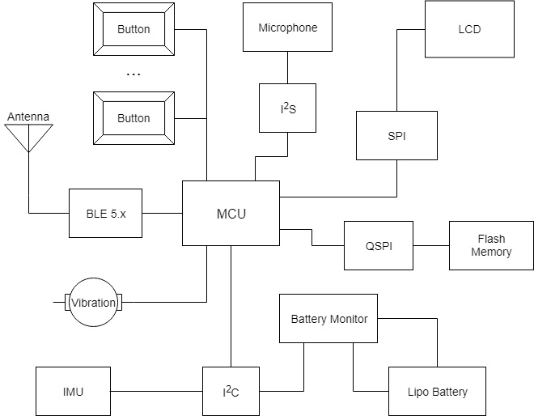
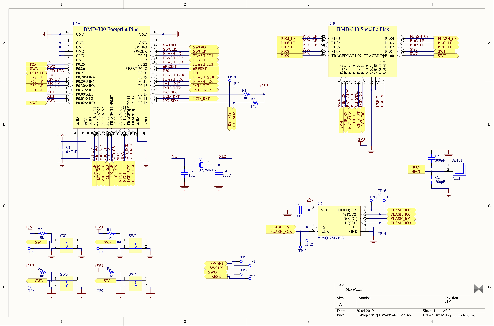
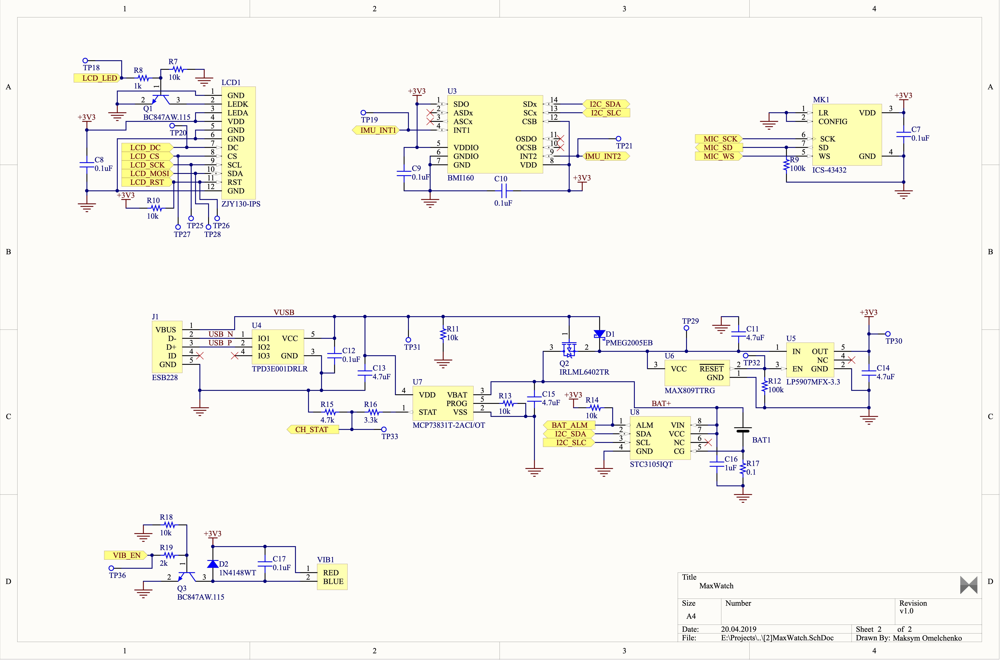
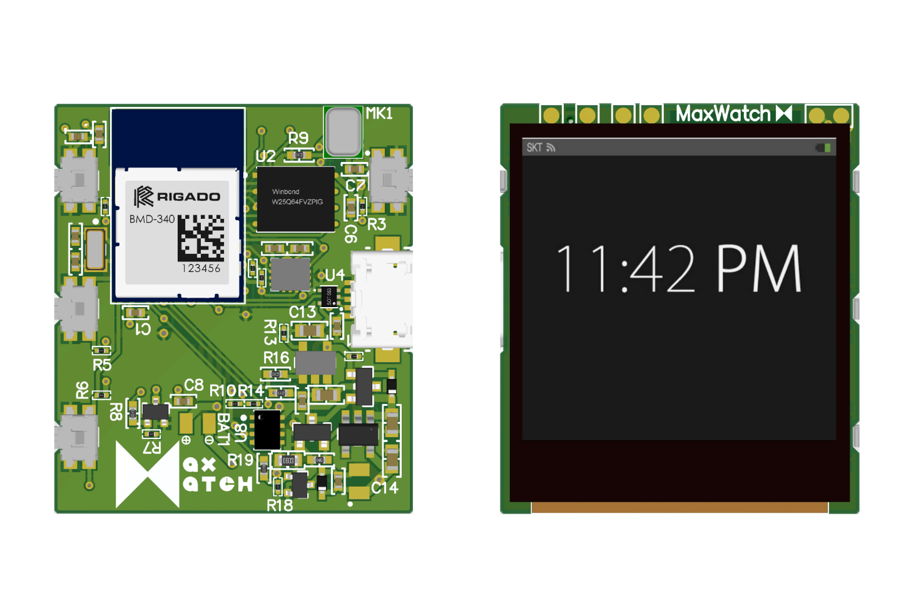
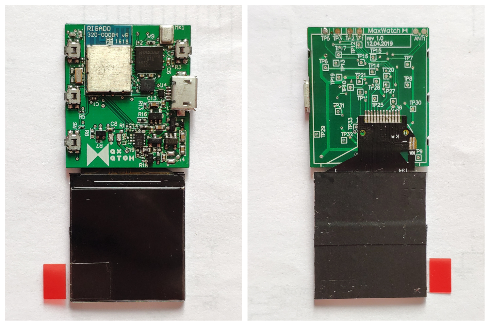

# MaxWatch

## Smartwatch system inspired by the [Pebble Time](https://www.kickstarter.com/projects/getpebble/pebble-time-awesome-smartwatch-no-compromises).

MaxWatch is a smartwatch system built from scratch in 2019. The final version of the project is the working prototype of the smartwatch. 

## Technical specification
| | |
|-|-|
| MCU            | Powerful & ultra-efficient 64MHz 32-bit ARM® Cortex™ M4F CPU   |
| RAM            | 256 kB                                                         |
| ROM            | 1 MB (flash on SoC) + 16 MB (dedicated flash)                  |
| Communications | Bluetooth 5.0 (with Thread and Zigbee support), USB 2.0, NFC-A |
| Controls       | 4 buttons                                                      |
| Screen         | 1.3 inch IPS display (240x240, 261 PPI)                        |
| Battery        | 200 mAH LIPO                                                   |
| Other          | Microphone, vibration, accelerometer & gyroscope               |
| | |
## System Diagram
MaxWatch system consists of many components, and the main ones are presented in the following diagram:

Here you can find all the main smartwatch components in the diagram below:
* **MCU**. Rigado BMD-340 (SoM powered by Nordic nRF52840).
* **Flash Memory**. Rigado Winbond Electronics W25Q128JVPIQ (128 IC FLASH 128MBIT).
* **IMU**. Bosch BMI160 (IMU combining accelerometer and gyroscope).
* **Microphone**. InvenSense ICS-43432 (digital output bottom port microphone).
* **LCD**. ZJY130-IPS screen module (powered by ST7789 controller).
* **Battery Monitor**. STMicroelectronics STC3105IQT (Battery Management Battery Monitor IC).

## Schematics
Of course, these components should communicate with each other, right? So, you can find the low-level schematics of the smartwatch system below.

The first image of the schema describes connections between such components as MCU, Flash, and buttons:

The second image of the schema describes power supply management as well as connections between such components as LCD, IMU, Microphone, and vibration motor.

> The full schematics can be found [here](Content/Schematics.pdf).

## Renders

## Real photos of the prototype

